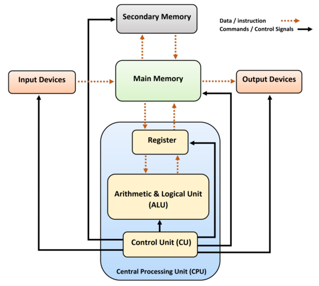
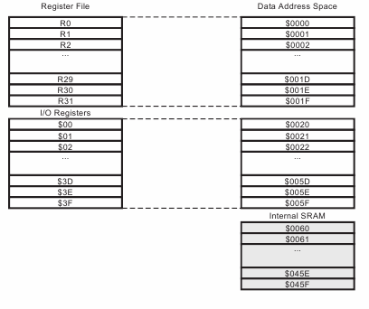

# Что такое программирование?
## Как устроен компьютер?

Любой компьютер, от микроконтроллера, управляющего вентиляцией в теплице, до вычислительных суперкомпьютеров содержит три основных компонента для работы с информацией.

* Процессор (CPU) – это как мозг компьютера. Он выполняет все вычисления и команды. Когда вы что-то делаете на компьютере, процессор производит вычисления и направляет результаты либо в память, либо в системы ввода-вывода.

* Оперативная память (RAM) – это рабочая зона для процессора. Когда вы запускаете программу, она загружается в RAM. В оперативной памяти хранятся данные промежуточных вычислений, описание потоков и прочая рабочая информация работающей программы. Чем больше оперативной памяти, тем больше программ можно запустить одновременно.

* Устройства ввода-вывода - это набор периферийных устройств, которые взаимодействуют с человеком, который пользуется компьютером. Например, клавиатура, принтер или сетевая карта, по которым данные циркулируют между внешним миром и самим компьютером.



### Работа с памятью
Оперативная память устроена как последовательность ячеек, в которых могут храниться числа в двоичной записи. Группа ячеек может быть пронумерована, и этот номер ячейки можно использовать как адрес для нахождения места в памяти. Адресация памяти — это процесс, с помощью которого процессор компьютера обращается к различным ячейкам памяти.

Память и адреса:
Пример структуры адресов памяти можно увидеть на картинке. На ней изображено адресное пространство микроконтроллера AVR.



Адресное пространство:

Процессор использует адресное пространство для обращения к памяти. Адресное пространство может быть линейным или сегментированным:
* Линейное адресное пространство – непрерывная последовательность адресов, с которыми процессор работает.
* Сегментированное адресное пространство – используется в некоторых архитектурах, где память делится на сегменты с разными функциями (код, данные, стек).

Процесс адресации:

Процессор генерирует логический адрес, который затем преобразуется в физический адрес с помощью различных механизмов, таких как таблицы страниц. Таблицы страниц – это структуры данных, которые операционная система использует для отображения виртуальных адресов в физические адреса.

_______

Адресация памяти — это важная часть работы компьютера, которая позволяет процессору эффективно управлять и использовать оперативную память. Она обеспечивает доступ к данным и программам, необходимым для выполнения задач.

### Как заставить компьютер что-то делать?
Процессор компьютера "общается" с миром на своем языке. Этот язык - машинный код, в котором каждая инструкция соответствует простейшему действию, которое может выполнить процессор. Машинный код неудобно читать человеку, поэтому инструкции в числовом формате заменяют их псевдонимами - мнемониками. Мнемоники – это короткие символические имена для команд процессора. Например, MOV используется для перемещения данных, ADD для сложения, SUB для вычитания. Такой формат машинного кода, более близкий к человеку, называется языком ассемблера.

Типичная программа на ассемблере выглядит так:
```asm
section .data
    msg db 'Hello, World!', 0    ; Сообщение для вывода

section .text
    global _start                ; Точка входа в программу

_start:
    ; Печать сообщения
    mov rax, 1                   ; Системный вызов write
    mov rdi, 1                   ; Файл дескриптор (stdout)
    mov rsi, msg                 ; Адрес сообщения
    mov rdx, 13                  ; Длина сообщения
    syscall                      ; Вызов системного прерывания

    ; Завершение программы
    mov rax, 60                  ; Системный вызов exit
    xor rdi, rdi                 ; Код возврата 0
    syscall                      ; Вызов системного прерывания
```

Особенностью программирования в таком варианте является то, что программист должен, помимо логики программы, понимать внутреннее устройство операционной системы и компьютера, на котором запускается код. В программе на ассемблере происходит прямая работа с регистрами.

Регистры – это небольшие области памяти внутри процессора, которые используются для выполнения операций. Ассемблер позволяет напрямую управлять памятью, что дает программисту возможность работать с конкретными адресами памяти.

Из-за этих особенностей код на ассемблере может быть очень эффективным, но при этом его крайне трудно обслуживать и невозможно напрямую адаптировать для работы на других процессорах и операционных системах. Написать на нем большие современные программы вроде браузеров или видеоигр практически невозможно – потребуется слишком много усилий и времени.

## Языки высокого уровня. Python.
Для того, чтобы упростить процесс программирования и сделать его более доступным, были созданы языки высокого уровня. Ранние компьютеры программировались только на ассемблере, что не всегда было удобно, особенно когда в разных институтах были разные компьютеры, программы для которых были несовместимы.

Основные причины появления языков высокого уровня:
* Упрощение программирования:
  - Языки высокого уровня используют более понятный и приближенный к человеческому языку синтаксис, что упрощает написание и чтение кода.
* Повышение продуктивности:
  - Программисты могут писать меньше строк кода для выполнения той же задачи, что повышает их продуктивность и снижает вероятность ошибок.
* Переносимость:
  - Языки высокого уровня обычно не зависят от конкретной архитектуры компьютера, что позволяет переносить программы между разными системами с минимальными изменениями.
* Автоматическое управление памятью:
  - Большинство языков высокого уровня предоставляют средства автоматического управления памятью, такие как сборка мусора, что освобождает программистов от необходимости вручную управлять памятью.

Код на языке высокого уровня проще писать, читать и поддерживать благодаря более понятному синтаксису. Благодаря встроенным механизмам проверки типов, отладке и обработке ошибок, вероятность программных ошибок снижается. Языки высокого уровня обычно поставляются с обширными стандартными библиотеками, которые содержат множество готовых к использованию функций и модулей для выполнения общих задач, а также программы на языках высокого уровня могут выполняться на различных операционных системах с минимальными изменениями.

Python является одним из наиболее популярных языков высокого уровня. В Python реализованы различные механизмы, сильно упрощающие разработку программ на нем. Одной из важных особенностей Python является то, что программы на нем практически всегда получаются не зависящими от архитектуры компьютера и операционной системы.


<details>
  <summary>Q1: Как называется центральный компонент компьютера, выполняющий все вычисления и команды?</summary>
  A1: Процессор (CPU)
</details>
<details>
  <summary>Q2: Что такое оперативная память (RAM) и для чего она используется?</summary>
  A2: Оперативная память (RAM) – это рабочая зона для процессора, в которой хранятся данные промежуточных вычислений и рабочая информация работающей программы.
</details>
<details>
  <summary>Q3: Что такое язык ассемблера?</summary>
  A3: Представление команд процессора в виде, доступном для чтения человеком. Программы, написанные на языке ассемблера, однозначным образом переводятся в инструкции конкретного процессора. 
</details>
<details>
  <summary>Q4: Почему языки высокого уровня были созданы для упрощения программирования?</summary>
  A4: Языки высокого уровня используют более понятный и приближенный к человеческому языку синтаксис, что упрощает написание и чтение кода.
</details>
<details>
  <summary>Q5: Что такое адресация памяти?</summary>
  A5: это важная часть работы компьютера, которая позволяет процессору эффективно управлять и использовать оперативную память. Она обеспечивает доступ к данным и программам, необходимым для выполнения задач.
</details>