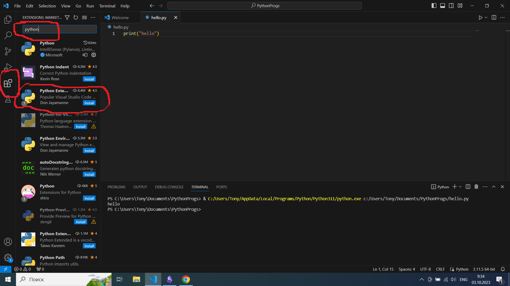
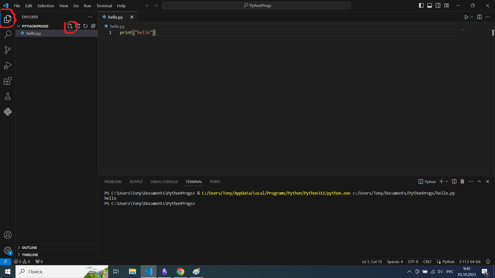

На этом уроке мы познакомимся с тем, как установить и настроить необходимые для работы с Python программы. Нам потребуется интерпретатор языка Python. Если на вашем компьютере стоит операционная система Windows 7, то нужно скачать и установить Python 3.8. Если же ваша операционная система новее, например Windows 10 или 11, то можно ставить последний релиз интерпретатора. Нужную версию интерпретатора для компьютера с операционной системой Windows вы можете найти по [ссылке](https://www.python.org/downloads/windows/). На странице выберите Download Windows installer в зависимости от разрядности и версии вашей системы. После загрузки установите интерпретатор и во время установки поставьте галочку add to PATH, чтобы Python автоматически обнаруживался при запуске команды в командной строке.

Также нам понадобится среда разработки. Это такой продвинутый блокнот, который подсвечивает слова языка программирования, следит за форматированием, позволяет запускать и отлаживать программы в одном окне с текстом, а также обладает еще целой кучей полезных возможностей. На занятиях мы будем работать в бесплатной среде Visual Studio Code. Скачать ее можно [здесь](https://code.visualstudio.com/).

После установки вам также потребуется скачать дополнительные расширения для работы с Python. Для этого откройте вкладку Extensions в VS Code.

В строке поиска наберите Python и скачайте выделенную коллекцию расширений Python Extension Pack.

После установки можно проверить работоспособность наших инструментов. Для этого в VS Code выберем File -> Open Folder и откроем папку, в которой будут храниться наши программы. После выбора папки перейдем на вкладку Explorer и нажмем кнопку создания нового файла.

Назовем новый файл hello.py и напишем в окне кода следующий текст: `print("hello")`. После этого запустим интерпретацию файла нажатием на стрелочку в верхнем правом углу. Если все правильно установлено, то в окне терминала внизу появится текст "hello", который вывела на экран наша программа.